# Network Anomaly Detection

Unsupervised anomaly detection on network flow data using **Isolation Forest** and a
**PyTorch AutoEncoder**.  Built on a synthetic dataset that mirrors the structure of the
[CICIDS2017](https://www.unb.ca/cic/datasets/ids-2017.html) benchmark.

## Architecture

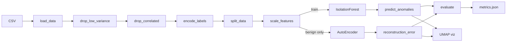

## Quick Start

```bash
# 1. Install dependencies
pip install -r requirements.txt

# 2. Run the full pipeline
bash run_pipeline.sh
```

## Project Structure

```
.
├── main.py                  # CLI entry point
├── run_pipeline.sh          # One-command pipeline runner
├── requirements.txt
├── mitre_mapping.md         # Feature → MITRE ATT&CK mapping
├── data/
│   ├── download_data.py     # Dataset loader + synthetic generator
│   └── cicids_sample.csv    # 50,000 flows × 84 features + label
├── src/
│   ├── preprocess.py        # Loading, cleaning, scaling, splitting
│   ├── isolation_forest.py  # IF training, prediction, evaluation
│   ├── autoencoder.py       # PyTorch AE: train, reconstruct, threshold
│   └── visualize.py         # UMAP 2-D projection plots
├── notebooks/
│   ├── 01_EDA.ipynb         # Exploratory data analysis
│   ├── 02_Preprocessing_Validation.ipynb
│   ├── 03_IsolationForest.ipynb
│   └── 04_Autoencoder.ipynb
├── outputs/
│   ├── metrics.json
│   ├── isolation_forest.pkl
│   ├── autoencoder.pth
│   └── figures/             # All plots
└── mitre_mapping.md
```

## CLI Usage

```bash
# Both models (default)
python main.py --model both --data data/cicids_sample.csv --output outputs/metrics.json

# Single model
python main.py --model isolation_forest
python main.py --model autoencoder --data data/cicids_sample.csv
```

| Flag | Choices | Default | Description |
|------|---------|---------|-------------|
| `--model` | `isolation_forest`, `autoencoder`, `both` | `both` | Model(s) to train and evaluate |
| `--data` | any `.csv` | `data/cicids_sample.csv` | Input dataset |
| `--output` | any `.json` | `outputs/metrics.json` | Metrics output path |

## Results (synthetic CICIDS sample)

| Metric | Isolation Forest | AutoEncoder |
|--------|:---------------:|:-----------:|
| Precision | 0.4437 | **0.9688** |
| Recall | **0.4434** | 0.1420 |
| F1 Score | **0.4436** | 0.2477 |
| ROC-AUC | 0.6406 | **0.9803** |

*The AutoEncoder achieves near-perfect ROC-AUC by learning a tight reconstruction
boundary around benign traffic.  Its high precision means false positives are rare,
at the cost of lower recall — a desirable trade-off in SOC triage workflows.*

## Figures

### EDA
| Class Imbalance | Correlation Heatmap | Feature Distributions |
|:---:|:---:|:---:|
| 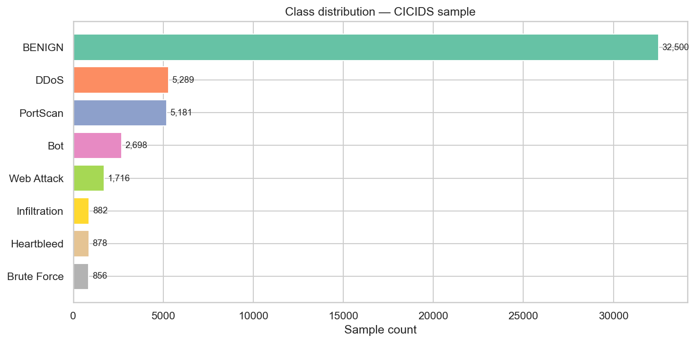 | 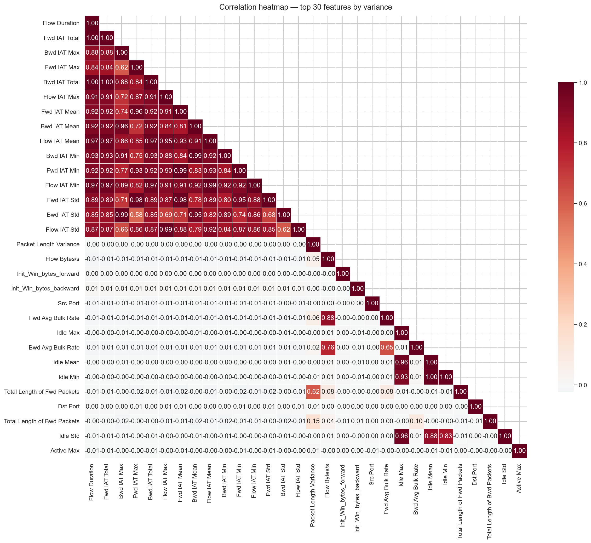 | 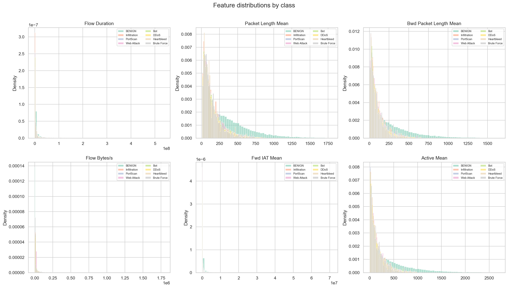 |

### Isolation Forest
| Score Distribution | Confusion Matrix |
|:---:|:---:|
| 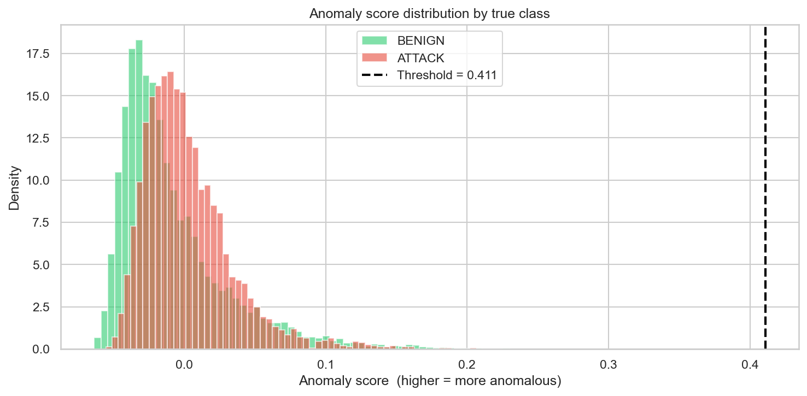 | 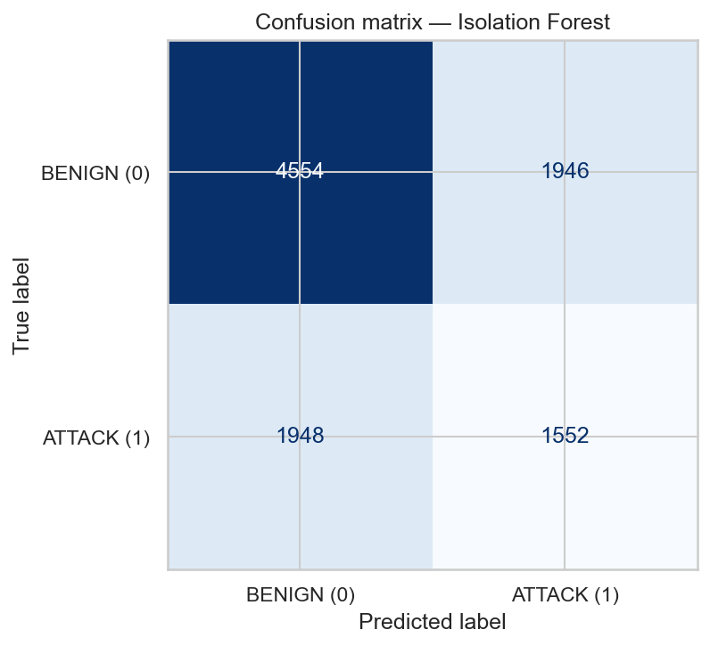 |

### AutoEncoder
| Loss Curve | Error Distribution | Confusion Matrix |
|:---:|:---:|:---:|
| 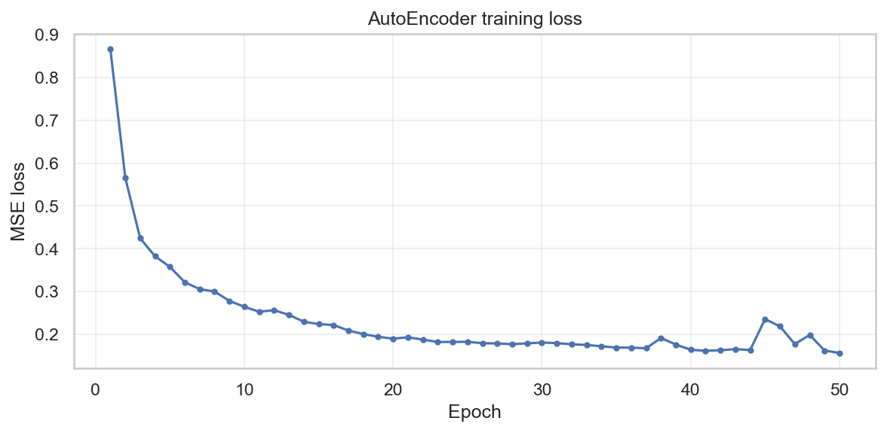 | 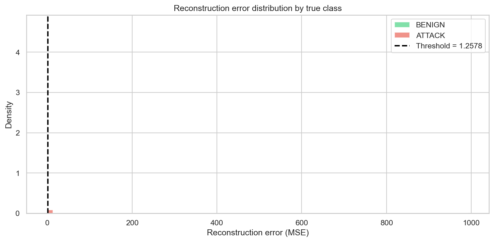 | 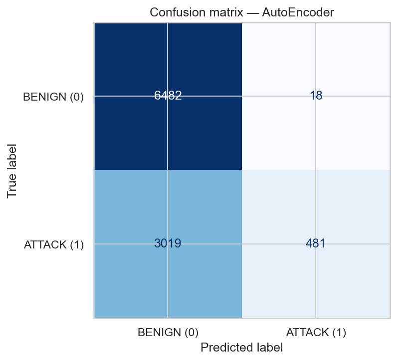 |

### UMAP Projections
| Isolation Forest | AutoEncoder |
|:---:|:---:|
| 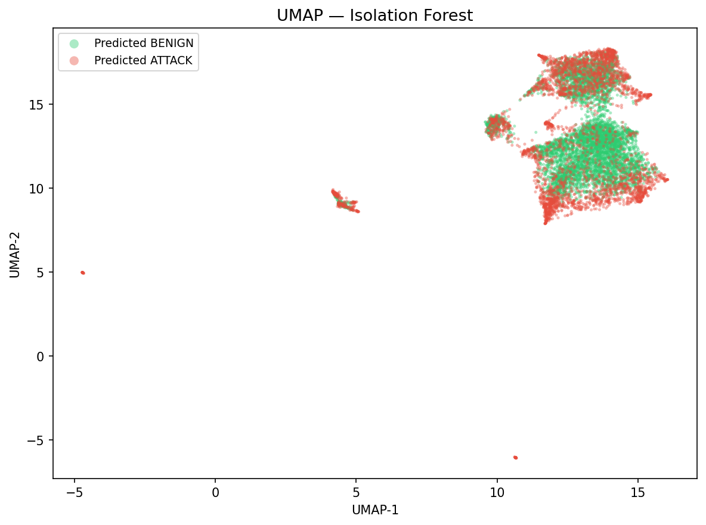 | 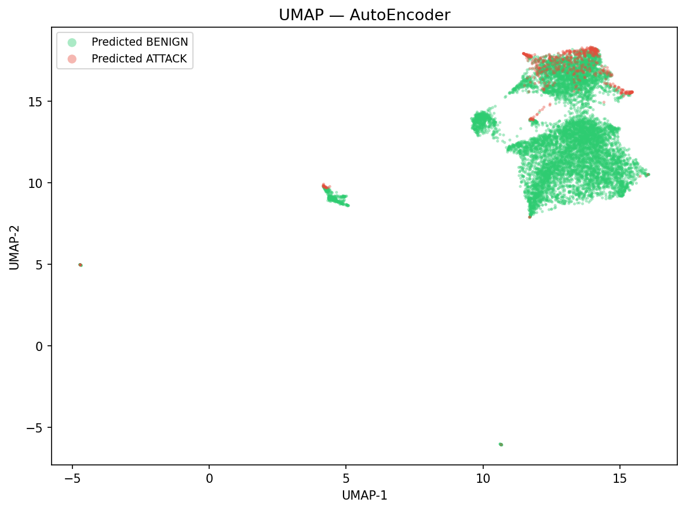 |

### Model Comparison
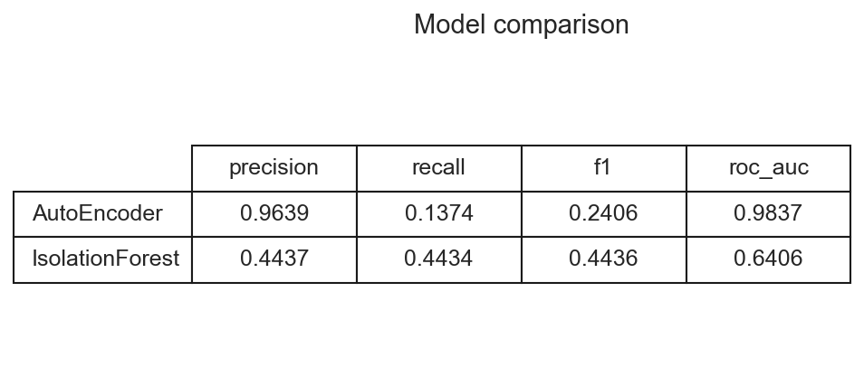

## Feature → MITRE ATT&CK

See [mitre_mapping.md](mitre_mapping.md) for a table mapping the top 15 engineered
features to [MITRE ATT&CK](https://attack.mitre.org/) technique IDs.

## Notebooks

| # | Notebook | Description |
|---|----------|-------------|
| 01 | `01_EDA.ipynb` | Shape, dtypes, missing values, class balance, correlations, distributions |
| 02 | `02_Preprocessing_Validation.ipynb` | Pipeline validation: zero-variance drop, correlation pruning, no-leakage scaling |
| 03 | `03_IsolationForest.ipynb` | IF training, anomaly score distribution, confusion matrix |
| 04 | `04_Autoencoder.ipynb` | AE training, loss curve, reconstruction error, side-by-side metrics comparison |

## Dependencies

- **Python** ≥ 3.10
- pandas, numpy, scikit-learn, matplotlib, seaborn, umap-learn, torch, jupyter, joblib
